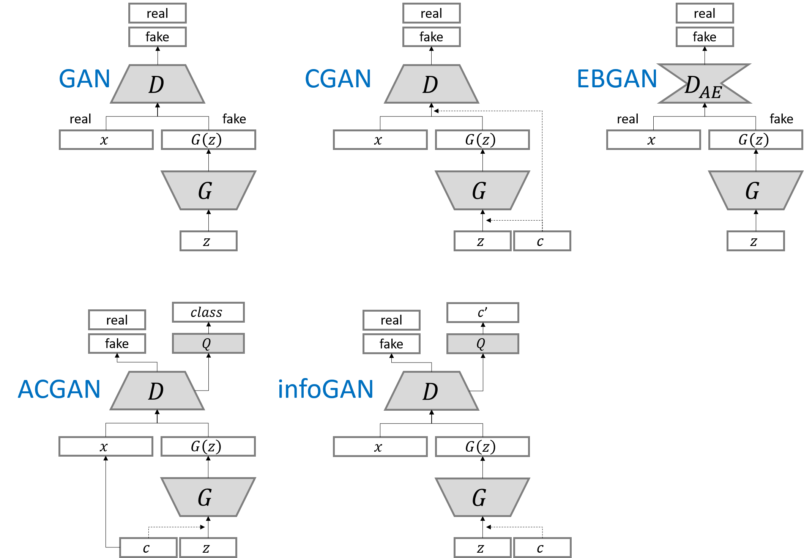

# pytorch-generative-model-collections

Take from: https://github.com/znxlwm/pytorch-generative-model-collections

Start training with the following simple command:

```shell
python main.py --dataset <DATASET_NAME> --gan_type <GAN_TYPE> --epoch 50 --batch_size 64
```

Pytorch implementation of various GANs.

This repository was re-implemented with reference to [tensorflow-generative-model-collections](https://github.com/hwalsuklee/tensorflow-generative-model-collections) by [Hwalsuk Lee](https://github.com/hwalsuklee)

## Generative Adversarial Networks (GANs)
### Lists (Table is borrowed from [tensorflow-generative-model-collections](https://github.com/hwalsuklee/tensorflow-generative-model-collections))

*Name* | *Paper Link* | *Value Function*
:---: | :---: | :--- |
**GAN** | [Arxiv](https://arxiv.org/abs/1406.2661) | 
**LSGAN**| [Arxiv](https://arxiv.org/abs/1611.04076) | 
**WGAN**| [Arxiv](https://arxiv.org/abs/1701.07875) | 
**WGAN_GP**| [Arxiv](https://arxiv.org/abs/1704.00028) | 
**DRAGAN**| [Arxiv](https://arxiv.org/abs/1705.07215) | 
**CGAN**| [Arxiv](https://arxiv.org/abs/1411.1784) | 
**infoGAN**| [Arxiv](https://arxiv.org/abs/1606.03657) | 
**ACGAN**| [Arxiv](https://arxiv.org/abs/1610.09585) | 
**EBGAN**| [Arxiv](https://arxiv.org/abs/1609.03126) | 
**BEGAN**| [Arxiv](https://arxiv.org/abs/1703.10717) |   

#### Variants of GAN structure (Figures are borrowed from [tensorflow-generative-model-collections](https://github.com/hwalsuklee/tensorflow-generative-model-collections))



## Datasets

- MNIST
- Fashion-MNIST
- CIFAR10
- SVHN
- STL10
- LSUN-bed

## Folder structure

The following shows basic folder structure.
```
├── main.py # gateway
├── data
│   ├── mnist # mnist data (not included in this repo)
│   ├── ...
│   ├── ...
│   └── fashion-mnist # fashion-mnist data (not included in this repo)
│
├── GAN.py # vainilla GAN
├── utils.py # utils
├── dataloader.py # dataloader
├── models # model files to be saved here
└── results # generation results to be saved here
```

## Acknowledgements
This implementation has been based on [tensorflow-generative-model-collections](https://github.com/hwalsuklee/tensorflow-generative-model-collections) and tested with Pytorch 0.4.0 on Ubuntu 16.04 using GPU.

